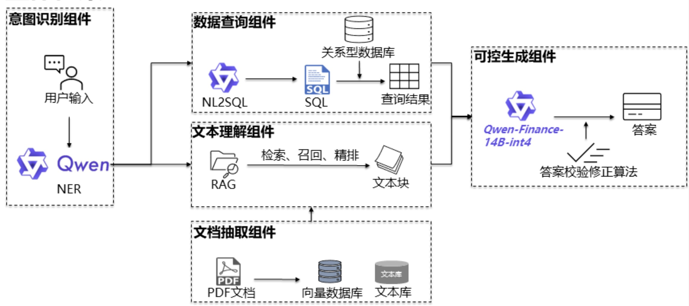

# 光环结业项目

## 介绍
金融千问机器人是一个 基于 `LLM` + `Agent` + `RAG` 的智能问答系统，该项目源于阿里天池的挑战赛。
**赛事内容地址**：https://tianchi.aliyun.com/competition/entrance/532172
**开源参考代码**：https://github.com/Tongyi-EconML/FinQwen

## 项目架构
根据之前参赛项目的经验，该项目预计的项目架构图如下：



## 目录说明

```bash
smart-finance-bot \
    |- doc \  # 该目录用于保存文档类文件，例如：需求文档、说明文档、数据文档
    |- agent \ # 该目录用于保存agent相关代码
    |- rag \   # 该目录用于保存rag相关代码
    |- web \   # 该目录用于保存前端页面代码以及langserve相关代码
    |- conf \  # 该目录用于保存配置文件
        |- .qwen # 该文件保存QWen的配置文件
```

## 使用说明

### 代码拉取

#### 第一步：安装git客户端

安装相关说明请见[gitee使用教程](https://blog.csdn.net/weixin_50470247/article/details/133585369)

#### 第二步：拉取代码

在命令行输入

```shell
git clone https://gitee.com/deadwalk/smart-finance-bot.git
```

#### 第三步：切换代码分支为develop分支

在命令行输入如下命令切换至develop开发分支

```shell
git checkout develop
```

#### 更新代码

在拉取代码之后，如果涉及到代码的二次更新，请在命令行输入如下命令更新最新的代码

```shell
git pull
```


### 组件安装

在当前目录下启动命令行，在命令行中运行如下命令

```shell script
pip install -r requirements.txt
```

